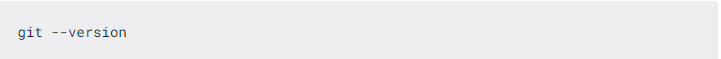
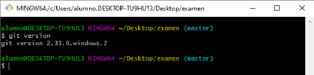

# ENTORNOS DE DESARROLLO

### UT1.- ElemEntos de desarrollo de software

 1. Desarrollo de softwarare (metodologias tradicionales)
	I.  Modelo en cascada
	II. Modelos evolutivos

 2. Metodologias ágiles

### UT2.- Instalacion y uso de entornos de desarrollo

  .Intellij Idea 

  .Eclipse 

  .Netbeans 

### UT3.- Sistemas de control de versiones

 
 

